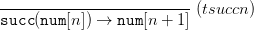
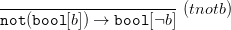
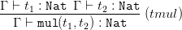
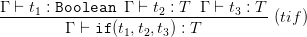

Introducción
------------

A continuación se definen los juicios de la semántica dinámica de las
EAB.








A continuación se definen los juicios de la semántica estática de las
EAB.








Ejecución
---------

Utilizando cabal de @cabal es sencillo cargar los ejemplos usando el
siguiente comando:

```
$ cabal repl
```

Y una vez en la REPL, puede correr cada uno de los ejemplos o todos
usando el `main`:

```
*Examples> main
```

A continuación se muestran los ejemplos disponibles.

```haskell
------------------------------
---------- EJEMPLOS ----------
------------------------------

eval1Ej1 :: Exp
eval1Ej1 = eval1 (Add (I 1) (I 2))
-- >> num[3]

eval1Ej2 :: Exp
eval1Ej2 = eval1 (Mul (I 4) (I 0))
-- >> num[0]

eval1Ej3 :: Exp
eval1Ej3 = eval1 (Let "y" (I 10) (Mul (V "y") (I 2)))
-- >> mul(num[10], num[2])

eval1Ej4 :: Exp
eval1Ej4 = eval1 (Let "y" (Succ (I 0)) (Lt (V "y") (I 0)))
-- >> let(num[1], y.lt(var[y], num[0]))

eval1Ej5 :: Exp
eval1Ej5 = eval1 (Let "y" (Add (I 2) (I 3)) (Mul (V "y") (I 0)))
-- >> let(num[5], y.mul(var[y], num[0]))

evalsEj1 :: Exp
evalsEj1 = evals (Mul (Mul (I 10) (I 2)) (B False))
-- >> mul(num[20], bool[False])

evalsEj2 :: Exp
evalsEj2 = evals (Let "y" (Succ (I 0)) (Lt (V "y") (I 0)))
-- >> bool[False]

evalsEj3 :: Exp
evalsEj3 =  evals (Let "y" (Pred (I 11)) (Lt (V "y") (I 10)))
-- >> bool[False]

evalsEj4 :: Exp
evalsEj4 =  evals (Let "y" (Mul (I 10) (I 10))
                (Eq (V "y") (I 100)))
-- >> bool[True]

evalsEj5 :: Exp
evalsEj5 =  evals (Let "y" (And (B True) (B True))
                (Or (V "y") (B False)))
-- >> bool[True]

evalEj1 :: Exp
evalEj1 = eval (Add (Mul (I 1) (I 6)) (I 9))
-- >> num[15]

evalEj2 :: Exp
evalEj2 =  eval (Succ (Mul (I 1) (I 6)))
-- >> num[7]

evalEj3 :: Exp
evalEj3 = eval (Pred (B True))
-- >> *** Exception: [Pred] requires a number ...

evalEj4 :: Exp
evalEj4 = eval (And (Eq (I 2) (I 2)) (Eq (Add (I 1) (I 1)) (I 2) ))
-- >> bool[True]

evalEj5 :: Exp
evalEj5 = eval (And (Eq (Mul (I 2) (I 4)) (Pred (I 9)))
  (Or (Eq (Add (I 4) (I 4)) (I 0) ) (B False)))
-- >> bool[False]

vtEj1 :: Bool
vtEj1 = vt [("x", Boolean)] (And (Eq (Mul (I 2) (I 4)) (Pred (I 9)))
  (Or (Eq (Add (I 4) (I 4)) (I 0) ) (V "x"))) Boolean
-- >> True

vtEj2 :: Bool
vtEj2 = vt [("x", Boolean)] (And (Eq (Mul (I 2) (I 4)) (Pred (I 9)))
  (Or (Eq (Add (I 4) (I 4)) (I 0) ) (V "x"))) Nat
-- >> False

vtEj3 :: Bool
vtEj3 = vt [("y", Boolean)] (And (And (B True) (B True))
  (Or (V "y") (B False))) Boolean
-- >> True

vtEj4 :: Bool
vtEj4 = vt [] (Let "x" (Add (I 1) (I 2))
  (Eq (Mul (Add (V "x") (I 5)) (I 0)) (Add (V "x") (I 2)))) Boolean
-- >> True

vtEj5 :: Bool
vtEj5 = vt [("x", Nat)] (Let "y" (Add (I 1) (I 2))
  (Eq (Mul (Add (V "x") (I 5)) (I 0)) (Add (V "x") (I 2)))) Boolean
-- >> True
```

Implementación
--------------

Se incluye una implementación de la semántica de las Expresiones
Aritmético Booleanas (**EAB**) cuya tipo de Haskell puede verse a
continuación.

```haskell
data Exp = V Id | I Int | B Bool | Add Exp Exp 
| Mul Exp Exp | Succ Exp | Pred Exp | Not Exp 
| And Exp Exp | Or Exp Exp | Lt Exp Exp | Gt Exp Exp 
| Eq Exp Exp | If Exp Exp Exp | Let Id Exp Exp deriving (Eq)
```

Además, se implementaron dos semánticas de las EAB.

### Semántica dinámica

Se implementaron las siguientes funciones principales:

-   **eval1**. Devuelve la transición  tal que `eval1`  =
    .
-   **evals**. Dado , devuelve  si existe  tal que
     y  está bloqueado.
-   **eval**. Devuelve la evaluación de un programa tal que `eval`  =
     y  es un valor. En caso de que 
    no sea un valor muestra un mensaje de error.

La parte más importante fue detectar los estados bloqueados en `eval1`
usando el tipo `Maybe`. Después fue fácil implementar `evals` en
términos de `eval1` y `eval` en términos de `evals`. Para `eval` además,
nos ayudamos del tipo `Either` para guardar nuestros mensajes de error.

### Semántica estática

Se implementó la siguiente función:

-   **vt**. Verifica el tipado de un programa tal que `vt`  `e`
     = `True`  `e` : .

Bibliografía
------------
